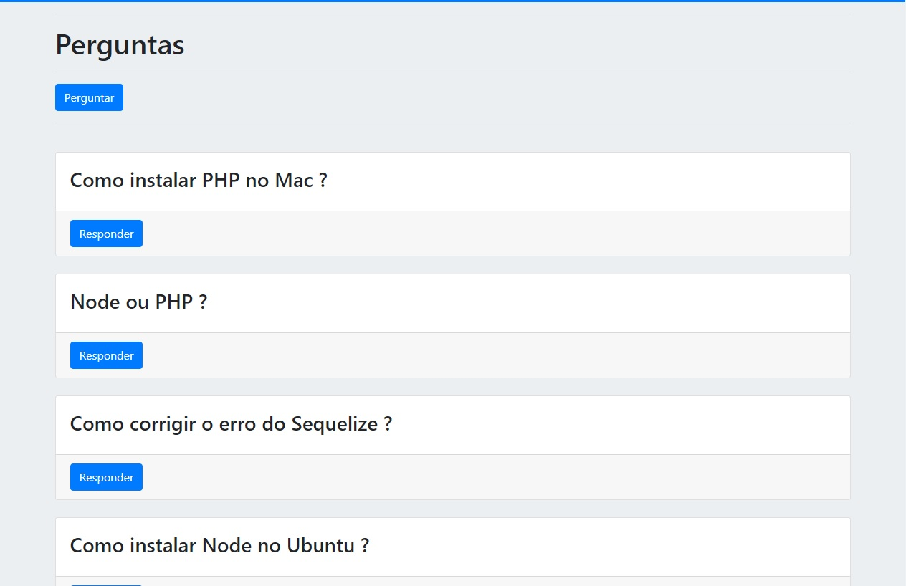

# 				Guia de Perguntas e Respostas

    <a href="#bookmark-sobre-o-projeto">Sobre</a>&nbsp;&nbsp;&nbsp;|&nbsp;&nbsp;&nbsp;
    <a href="#rocket-tecnologias-utilizadas">Tecnologias</a>&nbsp;&nbsp;&nbsp;|&nbsp;&nbsp;&nbsp;
    <a href="#rocket-bibliotecas-utilizadas">Bibliotecas</a>

    

## :bookmark: Sobre o Projeto

O **Perguntas e Respostas** é um projeto Web, que simula um portal de perguntas e repostas, com o intuito de simular uma conexão entre o Backend(NodeJS) e o BD MySQL, utilizando rotas e renderização com HTML utilizando EJS.

## :rocket: Tecnologias Utilizadas

-  [Html](https://www.w3schools.com/html/)
-  [CSS](https://www.w3schools.com/html/)
-  [Node](https://nodejs.org/en/)
-  [Javascript](https://www.w3schools.com/html/)
-  [MySQL](https://www.mysql.com/)
-  [Bootstrap](https://getbootstrap.com/)

## :rocket: Bibliotecas Utilizadas

- [Express](https://expressjs.com/pt-br/)

- [Body-Parser](https://www.npmjs.com/package/body-parser)

- [Sequelize](https://sequelize.org/)

- [EJS](https://ejs.co/)

- [Nodemon](https://www.npmjs.com/package/nodemon)

  

